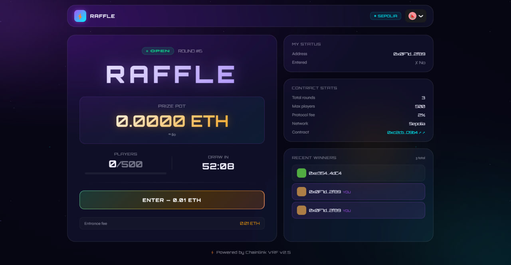
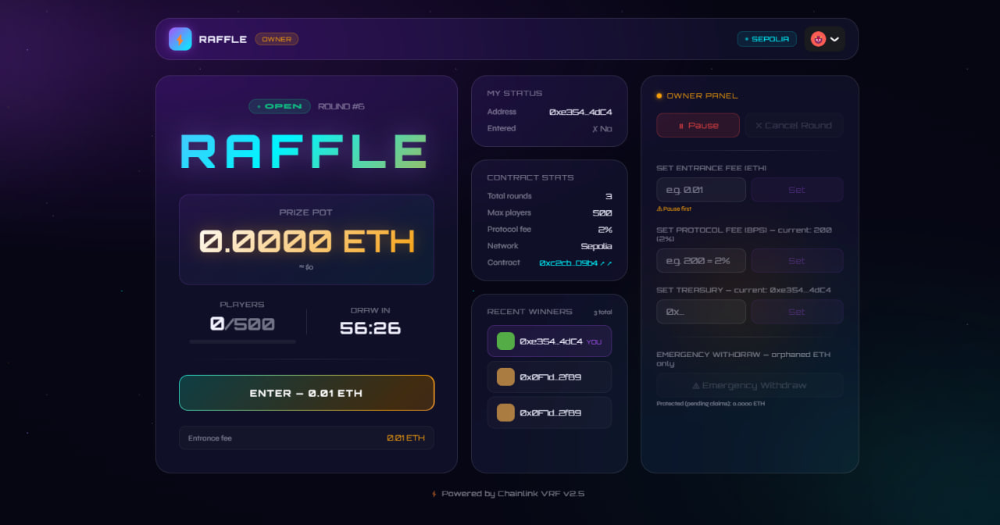
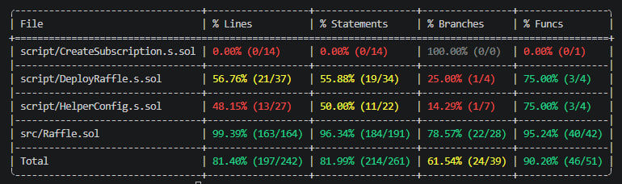

# ⚡ Raffle — Decentralized On-Chain Lottery

> A production-grade, fully decentralized lottery built on Ethereum Sepolia, powered by **Chainlink VRF v2.5** for verifiable randomness and **Chainlink Automation** for trustless, automatic draws — no server, no admin intervention.

[](https://raffle-mod.vercel.app/)
[](https://sepolia.etherscan.io/address/0xc2cb8835769662d48E31A4272Bfde1A2530DD9b4)
[](https://sepolia.etherscan.io/address/0xc2cb8835769662d48E31A4272Bfde1A2530DD9b4#code)
[](#testing)
[](https://github.com/GOLIBJON-developer/Lottery/actions/workflows/test.yml)

**Live:** https://raffle-mod.vercel.app
**Contract:** [`0xc2cb8835769662d48E31A4272Bfde1A2530DD9b4`](https://sepolia.etherscan.io/address/0xc2cb8835769662d48E31A4272Bfde1A2530DD9b4)

---

## Screenshots

### Player View

*Any connected wallet can enter the current round, track the prize pot, countdown timer, and claim winnings.*

### Owner Dashboard

*When the deployer wallet is connected, a third column appears with full administrative controls: pause, cancel, fee configuration, and emergency tools.*

### Test Coverage

*101 tests across unit, fuzz, and integration suites — all passing.*

---

## Table of Contents

- [What It Does](#what-it-does)
- [Why I Built This](#why-i-built-this)
- [How It Works](#how-it-works)
- [Architecture](#architecture)
- [Smart Contract](#smart-contract)
  - [Deployed Address](#deployed-address)
  - [Features](#features)
  - [Functions Reference](#functions-reference)
  - [Bug Fixes Applied](#bug-fixes-applied)
  - [Gas Optimized Version](#gas-optimized-version)
- [Frontend](#frontend)
  - [Player Features](#player-features)
  - [Owner Features](#owner-features)
  - [Implementation Notes](#implementation-notes)
- [Testing](#testing)
  - [Test Coverage](#test-coverage)
  - [Running Tests](#running-tests)
- [CI / CD](#ci--cd)
- [Local Development](#local-development)
- [Deployment Guide](#deployment-guide)
- [Project Structure](#project-structure)
- [Known Issues and Limitations](#known-issues-and-limitations)
- [Lessons Learned](#lessons-learned)
- [Security](#security)
- [Tech Stack](#tech-stack)

---

## What It Does

Raffle is a trustless on-chain lottery where:

1. Players pay a fixed ETH entrance fee to join the current round
2. After a configurable interval, **Chainlink Automation** automatically triggers the draw
3. **Chainlink VRF** generates a cryptographically verifiable random number on-chain
4. The winner is selected — no one can predict or influence the outcome
5. Winner calls `claimWinnings()` to receive ETH (pull-payment pattern)

There is no centralized server. There is no admin button to pick a winner manually. The smart contract enforces every rule.

---

## Why I Built This

I built this project to go beyond simple token contracts and understand how real decentralized applications work end-to-end: how oracle networks integrate with smart contracts, how to handle asynchronous VRF callbacks securely, how to write production-grade tests with Foundry, and how to build a frontend that reads live blockchain state.

The specific problems I wanted to solve:

- **Verifiable randomness** — `block.timestamp` and `blockhash` can be influenced by validators. Chainlink VRF cannot.
- **Trustless automation** — a centralized cron job is a single point of failure. Chainlink Automation is decentralized.
- **Security patterns** — pull payments, CEI pattern, reentrancy guards, emergency mechanisms with bounded access.
- **Real bugs, real fixes** — after initial implementation I audited the contract myself and found 7 logic issues (documented in [Bug Fixes Applied](#bug-fixes-applied)).

---

## How It Works

```
1. Players call enterRaffle() paying the entrance fee in ETH
         |
2. Chainlink Automation monitors checkUpkeep() every block
         |
3. When interval passes and conditions are met, performUpkeep() is triggered
         |
4. A Chainlink VRF request is sent — a verifiably random number is returned
         |
5. fulfillRandomWords() selects the winner, credits winnings (pull pattern)
         |
6. Winner calls claimWinnings() to receive ETH
```

**Five conditions must ALL be true before a draw triggers:**

| Condition | Why |
|---|---|
| `!paused` | Owner can halt the raffle at any time |
| `state == OPEN` | No draw already in progress |
| `block.timestamp - lastTimestamp > interval` | Time interval has elapsed |
| `players.length >= 2` | At least 2 entrants for a meaningful lottery |
| `currentRoundPot > 0` | ETH in the pot |

---

## Architecture

```
+--------------------------------------------------+
|              Next.js 14 Frontend                 |
|   Wagmi v2  Viem  RainbowKit  TanStack Query     |
|                                                  |
|  RaffleApp (orchestrator)                        |
|  +-- RaffleCard    enter, pot, claim             |
|  +-- OwnerPanel    admin controls (owner only)   |
|  +-- WinnersList   live + historical winners     |
|  +-- UserStatus    connected wallet status       |
|  +-- ContractStats on-chain stats                |
|                                                  |
|  useRaffleData   15 reads batched, 12s polling   |
|  useRaffleWrite  write + confirmation + toast    |
+------------------+-------------------------------+
                   |  JSON-RPC
+------------------v-------------------------------+
|              Raffle.sol  (Sepolia)               |
|                                                  |
|  enterRaffle()   checkUpkeep()   claimWinnings() |
|  performUpkeep() cancelRaffle()  emergencyWithdraw|
|  fulfillRandomWords()  <-- VRF callback          |
+--------+-----------------------+-----------------+
         |                       |
+--------v---------+  +----------v--------------+
| Chainlink VRF    |  | Chainlink Automation     |
| v2.5 verifiable  |  | decentralized upkeep     |
| randomness       |  | no cron job needed       |
+------------------+  +-------------------------+
```

---

## Smart Contract

### Deployed Address

| Network | Address | Status |
|---|---|---|
| Sepolia | [`0xc2cb8835769662d48E31A4272Bfde1A2530DD9b4`](https://sepolia.etherscan.io/address/0xc2cb8835769662d48E31A4272Bfde1A2530DD9b4) | ✅ Verified |

Contract source is publicly verified on Etherscan — every line of logic is auditable by anyone.

### Features

| # | Feature | Description |
|---|---|---|
| 1 | **Pull payment pattern** | Winners call `claimWinnings()` — no ETH push to unknown addresses |
| 2 | **Prize pot isolation** | `s_currentRoundPot` tracks only current round ETH. Previous unclaimed winnings never bleed into the new prize |
| 3 | **ReentrancyGuard** | CEI pattern + `nonReentrant` modifier as a double safety layer |
| 4 | **Pause / Unpause** | Owner can halt entries and automation at any time |
| 5 | **Rich events** | Every action emits an event with full context (amount, roundId, timestamp) |
| 6 | **Refund mechanism** | `cancelRaffle()` credits all players; they pull refunds via `claimRefund()` |
| 7 | **MIN_PLAYERS guard** | Draw only triggers with at least 2 players |
| 8 | **Duplicate entry guard** | `s_hasEntered` mapping — one ticket per address per round |
| 9 | **Emergency withdraw** | Owner can drain only orphaned ETH; `s_pendingClaims` is always protected |
| 10 | **Mutable entrance fee** | `setEntranceFee()` — requires pause to protect live rounds |
| 11 | **Winner history** | Full on-chain winner array via `getWinnerHistory()` |
| 12 | **Protocol fee** | Configurable BPS fee (max 10%) credited to a treasury address |
| 13 | **Multi-round tracking** | `RoundResult` struct stored per round ID |
| 14 | **Excess ETH refund** | Overpayments returned immediately; pot only holds exact entrance fee |

### Functions Reference

#### Player Functions

| Function | Type | Description |
|---|---|---|
| `enterRaffle()` | `payable` | Enter the current round by sending the entrance fee |
| `claimWinnings()` | `nonpayable` | Claim ETH prize after winning |
| `claimRefund()` | `nonpayable` | Claim refund if the round was cancelled |

#### Automation (called by Chainlink)

| Function | Type | Description |
|---|---|---|
| `checkUpkeep(bytes)` | `view` | Returns `true` when all 5 draw conditions are met |
| `performUpkeep(bytes)` | `nonpayable` | Locks the raffle and fires a VRF request |

#### Owner Functions

| Function | Requires | Description |
|---|---|---|
| `pause()` | owner | Halt the raffle |
| `unpause()` | owner | Resume; resets the interval countdown |
| `cancelRaffle()` | owner + paused | Cancel current round, credit refunds |
| `setEntranceFee(uint256)` | owner + paused | Update entrance fee (wei) |
| `setProtocolFee(uint256)` | owner + paused | Update fee in BPS (200 = 2%, max 1000) |
| `setTreasury(address)` | owner + paused | Update protocol fee recipient |
| `emergencyWithdraw()` | owner + paused | Drain orphaned ETH (not pending claims) |

#### View / Pure Getters

| Function | Returns |
|---|---|
| `getRaffleState()` | `0`=OPEN `1`=CALCULATING `2`=CANCELLED |
| `getEntranceFee()` | Current fee in wei |
| `getCurrentRoundPot()` | ETH in current round |
| `getNumberOfPlayers()` | Active player count |
| `getLastTimeStamp()` | Unix timestamp of last draw reset |
| `getInterval()` | Draw interval in seconds |
| `getRecentWinner()` | Most recent winner address |
| `getWinnerHistory()` | All-time winner address array |
| `getCurrentRoundId()` | Current round number |
| `getPendingClaims()` | Total ETH owed to users (protected) |
| `getWinnings(address)` | Claimable prize for a given address |
| `getRefund(address)` | Claimable refund for a given address |
| `getRoundResult(uint256)` | Full `RoundResult` struct for a round |
| `hasEntered(address)` | Whether an address entered this round |
| `isPaused()` | Current pause state |

### Bug Fixes Applied

After initial implementation, a full review identified and fixed 7 logic bugs:

| # | Bug | Impact | Fix |
|---|---|---|---|
| 1 | **Prize pot bleed** — `address(this).balance` used as prize | Previous unclaimed winnings added to new round pot — effectively taxing past winners | Introduced `s_currentRoundPot` to track only the current round's collected ETH |
| 2 | **Cancel deadlock** — `s_hasEntered` not cleared on cancel | All players permanently locked out of future rounds after any cancellation | Added `delete s_hasEntered[player]` inside the cancel refund loop |
| 3 | **Silent excess ETH kept** — overpayment absorbed into pot | Players sending more than entrance fee lost the extra ETH with no notification | Added immediate refund: `msg.value - entranceFee` returned to sender in `enterRaffle()` |
| 4 | **No pause guard on config** — `setProtocolFee` / `setTreasury` callable anytime | Owner could change fee % or treasury address mid-round, affecting players who had already entered | All config functions now require `_paused == true` |
| 5 | **emergencyWithdraw rug risk** — could drain all ETH | Owner could take user winnings and pending refunds | Bounded to `balance - s_pendingClaims` — legitimate user funds always protected |
| 6 | **CANCELLED state invisible** — immediately reset to OPEN after cancel | State was cosmetic only; checkUpkeep could trigger a new draw on the very next block | State stays CANCELLED until `unpause()` is explicitly called |
| 7 | **OZ Ownable + Chainlink conflict** — fatal `E6480` compiler error | `VRFConsumerBaseV2Plus` already inherits `ConfirmedOwnerWithProposal` which defines `onlyOwner`, `owner()`, and `OwnershipTransferred` — same symbols as OZ Ownable | Removed OZ Ownable entirely; wrote a minimal `RafflePausable` abstract contract with zero external dependencies |

### Gas Optimized Version

`src/RaffleGasOptimized.sol` is an alternative implementation with the same logic but storage-packed slots:

```
Standard version:   9 storage slots  (9 x 2,100 = 18,900 gas cold SLOAD)
Optimized version:  4 storage slots  (4 x 2,100 =  8,400 gas cold SLOAD)
Reduction:                                         10,500 gas  (55%)
```

**Packed layout:**

```
Slot A  s_treasury (20 bytes)      s_entranceFee (12 bytes)
Slot B  s_recentWinner (20 bytes)  s_lastTimeStamp (4 bytes)
        s_protocolFeeBps (2 b)     s_raffleState (1 b)  _paused (1 b)
Slot C  s_currentRoundPot (16 b)   s_pendingClaims (16 bytes)
Slot D  s_currentRoundId (8 bytes)
```

Key savings per function:

| Function | Standard | Optimized | Saved |
|---|---|---|---|
| `checkUpkeep()` | ~10,500 gas | ~6,300 gas | **4,200 gas** |
| `enterRaffle()` | ~80,000 gas | ~78,000 gas | **~2,000 gas** |
| `fulfillRandomWords()` | ~120,000 gas | ~103,000 gas | **~17,000 gas** |

> `checkUpkeep()` is called by Chainlink every block (~7,200 times/day). The 4,200 gas saving per call adds up significantly at scale.

---

## Frontend

**Live:** [https://raffle-mod.vercel.app](https://raffle-mod.vercel.app)

Built with Next.js 14 (App Router), Wagmi v2, Viem, and RainbowKit.

### Player Features

- Connect any EVM wallet (MetaMask, WalletConnect, Coinbase Wallet, etc.)
- See real-time prize pot, player count, and countdown to next draw
- One-click raffle entry at the current entrance fee
- Live winner feed via `WinnerPicked` event subscription
- **Claim Prize** button appears automatically if you won
- **Claim Refund** button appears if your round was cancelled
- "YOU" badge on your address in the winners list

### Owner Features

Owner panel only renders when the deployer wallet is connected (verified against `raffle.owner()` on-chain — no hardcoded address):

- **Pause / Unpause** — single button, state-aware label
- **Cancel Round** — only enabled when paused + OPEN state
- **Set Entrance Fee** — input field with pause warning
- **Set Protocol Fee** — BPS input with live current value display
- **Set Treasury** — address input with validation
- **Emergency Withdraw** — shows protected pending claims amount

### Implementation Notes

- `useReadContracts` batches all 15 contract reads into a single RPC call — one request instead of 15
- `useWatchContractEvent` subscribes to `WinnerPicked` and `RaffleEnter` for real-time UI updates without polling
- Owner panel checks `raffle.owner()` on-chain — no hardcoded address in frontend code
- `isSuccess` side effects are handled in `useEffect` — prevents infinite re-render loop (a common React + Wagmi bug)
- Explicit Alchemy RPC transport configured in `wagmi.ts` — default thirdweb endpoint blocks CORS from custom domains

---

## Testing

### Test Coverage


```
Total:       101 tests
Unit:         95 tests (including 8 fuzz properties)
Integration:   6 end-to-end scenarios
Fuzz runs:  1,000 per property
Result:     All passing
```

### Coverage by Area

| Area | Tests | What is verified |
|---|---|---|
| Constructor | 4 | All 3 deploy-time validations |
| `enterRaffle()` | 8 | All revert paths, excess refund, pot accounting, duplicate guard |
| `checkUpkeep()` | 7 | Each of the 5 conditions tested independently |
| `performUpkeep()` | 4 | State transition, event emission, access control |
| `fulfillRandomWords()` | 9 | Winner is always a player, prize split, state reset, history |
| `claimWinnings()` | 5 | ETH transfer, event, double-claim prevention |
| `claimRefund()` | 5 | ETH transfer, event, double-claim prevention |
| Pause / Unpause | 5 | Blocks entry, blocks upkeep, timestamp reset, state |
| `cancelRaffle()` | 9 | Refunds credited, `hasEntered` cleared, state stays CANCELLED |
| Emergency withdraw | 5 | Orphaned ETH only, pending claims untouched |
| Config functions | 8 | All setters update correctly, pause requirement enforced |
| **Fuzz: any EOA can enter** | 1,000 | Random valid addresses |
| **Fuzz: prize split always correct** | 1,000 | `prize + fee == pot` for all BPS values 0–1000 |
| **Fuzz: excess always refunded** | 1,000 | Any overpayment fully returned |
| **Fuzz: pot accounting** | 1,000 | Pot always equals sum of entrance fees |
| **Fuzz: winner is always a player** | 1,000 | Random seed — winner always in the entered list |
| Integration: full round | 1 | Enter → draw → VRF → win → claim end-to-end |
| Integration: cancel + refund | 1 | Pause → cancel → refund → re-enter next round |
| Integration: 3 consecutive rounds | 1 | Pot isolation, history, round ID correctness |
| Integration: pot isolation | 1 | Unclaimed prizes never bleed into subsequent rounds |
| Integration: config update | 1 | Pause → change fee → unpause → new round at new fee |
| Integration: emergency withdraw | 1 | Protected pending claims, orphaned ETH only |

### Running Tests

```bash
# All tests
forge test -v

# Unit tests only
forge test --match-path test/unit/RaffleTest.t.sol -vv

# Integration tests
forge test --match-path test/integration/RaffleIntegrationTest.t.sol -vv

# Gas report
forge test --gas-report

# Coverage (requires lcov: brew install lcov)
forge coverage --report lcov
genhtml lcov.info --branch-coverage --output-dir coverage/
open coverage/index.html
```

---

## CI / CD

GitHub Actions runs automatically on every push and pull request to `main`:

```
Install Foundry
forge install
forge build --sizes
forge test -v
forge snapshot  (gas baseline saved as artifact)
```

The CI badge at the top of this README reflects the latest run status.

---

## Local Development

### Prerequisites

- [Node.js 20+](https://nodejs.org)
- [Foundry](https://book.getfoundry.sh/getting-started/installation)
- Sepolia ETH + LINK from [faucets.chain.link](https://faucets.chain.link)
- [WalletConnect Cloud](https://cloud.walletconnect.com) project ID

### Setup

```bash
git clone https://github.com/GOLIBJON-developer/Lottery
cd lottery

# Foundry dependencies
forge install

# Frontend dependencies
cd raffle-ui
npm install
```

### Run locally

```bash
# Terminal 1 — local chain
anvil

# Terminal 2 — deploy to Anvil
forge script script/DeployRaffle.s.sol --broadcast

# Terminal 3 — frontend
cd raffle-ui
npm run dev
# Open http://localhost:3000
```

---

## Deployment Guide

### Environment Variables

Create `.env` in the project root:

```env
# RPC
SEPOLIA_RPC_URL=https://eth-sepolia.g.alchemy.com/v2/YOUR_KEY

# Foundry keystore account name (cast wallet import)
ACCOUNT=your-keystore-name

# Block explorer
ETHERSCAN_API_KEY=YOUR_KEY

# Set AFTER Step 1 below
SUBSCRIPTION_ID=0
```

### Smart Contract Deployment

Deployment uses a **two-step** process because `createSubscription()` generates the subscription ID using `blockhash` — it differs between Foundry's local dry-run and the actual on-chain execution. Splitting the steps eliminates this mismatch.

**Step 1 — Create VRF subscription**

```bash
make create-sub-sepolia ACCOUNT=your-account
```

Copy the printed subscription ID into `.env` as `SUBSCRIPTION_ID`.

**Step 2 — Deploy and verify**

```bash
make deploy-sepolia ACCOUNT=your-account
```

This single command:
1. Funds the VRF subscription with 3 LINK
2. Deploys `Raffle.sol`
3. Registers the contract as a VRF consumer
4. Verifies source code on Etherscan automatically

**Step 3 — Register Chainlink Automation**

1. Go to [automation.chain.link](https://automation.chain.link) → Sepolia
2. **Register new Upkeep** → **Custom Logic**
3. Enter deployed contract address
4. Fund with 0.5–1 LINK
5. Confirm

**Step 4 — Update frontend**

```typescript
// raffle-ui/lib/contract.ts
export const RAFFLE_ADDRESS = "0xYourDeployedAddress" as const
```

### Frontend Deployment

**Vercel (recommended)**

```bash
cd raffle-ui
npx vercel --prod
# Set NEXT_PUBLIC_WALLETCONNECT_ID in Vercel project settings
```

Or connect the repo at [vercel.com/new](https://vercel.com/new):
1. Set **Root Directory** to `raffle-ui`
2. Add env var: `NEXT_PUBLIC_WALLETCONNECT_ID`

---

## Project Structure

```
lottery/
|
+-- src/
|   +-- Raffle.sol                    Main contract (14 features, 7 bugs fixed)
|   +-- RaffleGasOptimized.sol        Storage-packed variant (55% fewer cold SLOADs)
|
+-- script/
|   +-- CreateSubscription.s.sol      Deploy step 1 (VRF subscription)
|   +-- DeployRaffle.s.sol            Deploy step 2 (fund + deploy + consumer + verify)
|   +-- HelperConfig.s.sol            Network config (Anvil / Sepolia)
|   +-- Interactions.s.sol            Manual helpers
|
+-- test/
|   +-- unit/
|   |   +-- RaffleTest.t.sol          95 unit + fuzz tests
|   +-- integration/
|   |   +-- RaffleIntegrationTest     6 end-to-end scenarios
|   +-- mocks/
|       +-- VRFCoordinatorV2_5Mock.sol
|       +-- LinkToken.sol
|
+-- raffle-ui/                        Next.js 14 frontend
|   +-- app/
|   |   +-- layout.tsx
|   |   +-- page.tsx
|   |   +-- providers.tsx             Wagmi + RainbowKit providers
|   |   +-- globals.css
|   +-- components/
|   |   +-- RaffleApp.tsx             Root orchestrator
|   |   +-- raffle/
|   |   |   +-- RaffleCard.tsx        Prize pot, enter, claim
|   |   |   +-- OwnerPanel.tsx        Admin controls
|   |   |   +-- WinnersList.tsx       Live + history winners
|   |   |   +-- UserStatus.tsx        Connected wallet status
|   |   |   +-- ContractStats.tsx     On-chain stats
|   |   |   +-- StatusBadge.tsx       OPEN / PAUSED / CALCULATING badge
|   |   +-- ui/
|   |       +-- Toast.tsx
|   |       +-- Divider.tsx
|   |       +-- StatRow.tsx
|   +-- hooks/
|   |   +-- useRaffleData.ts          15 reads batched into one RPC call
|   |   +-- useRaffleWrite.ts         Write + confirmation + toast pattern
|   +-- lib/
|       +-- contract.ts               ABI + deployed address
|       +-- wagmi.ts                  Wagmi config with explicit RPC transport
|       +-- utils.ts                  Shared formatters and constants
|
+-- img/
|   +-- ui-user.jpg
|   +-- ui-owner.jpg
|   +-- coverage.jpg
|
+-- .github/
|   +-- workflows/
|       +-- test.yml                  CI: build + test + gas snapshot
|
+-- foundry.toml
+-- Makefile
+-- README.md
```

---

## Known Issues and Limitations

**VRF subscription cost on testnet**

On Sepolia, gas price spikes can cause a single VRF request to cost far more LINK than expected (observed: 162 LINK during a high-congestion period vs the typical ~0.25 LINK on mainnet). This is a testnet-specific behavior. If a VRF request goes pending due to insufficient subscription balance, fund the subscription at [vrf.chain.link](https://vrf.chain.link) — the pending request fulfills automatically.

**No stuck-state recovery function**

If a VRF request expires after 24 hours without fulfillment, the contract gets stuck in `CALCULATING` state with no automated recovery path. A `resetStuckState()` owner function is the planned fix for a v2 deployment.

**Single ticket per address**

One entry per wallet per round. Multiple tickets (more entries = more chances) are not supported — this simplifies accounting and eliminates a class of tracking bugs, but is a feature limitation.

**Modulo bias in winner selection**

```solidity
uint256 indexOfWinner = randomWords[0] % playerCount;
```

With Chainlink VRF's 256-bit output, the statistical bias is negligible in practice (less than 0.00001% for 500 players). A rejection-sampling approach would eliminate it entirely.

---

## Lessons Learned

**Chainlink VRF is asynchronous — design for the gap**

`performUpkeep` fires the VRF request. `fulfillRandomWords` is called 2–3 blocks later by the Chainlink node. The intermediate `CALCULATING` state must be handled gracefully — players cannot enter, `checkUpkeep` must return false, and the UI must reflect this. I initially underestimated how much of the contract's complexity lives in managing this asynchronous window.

**Blockhash-based IDs break Foundry's two-phase execution**

`createSubscription()` uses `blockhash(block.number - 1)` to generate the subscription ID. Foundry runs scripts twice: locally to collect transactions, then on a fork for simulation — different blocks, different hashes, different IDs. The locally-captured subscription ID does not exist on the forked state, causing `InvalidSubscription()` errors. The fix was a deliberate two-step deployment process with `--skip-simulation` for the dependency-heavy step.

**Inherited ownership conflicts are a compiler-level problem**

`VRFConsumerBaseV2Plus` inherits `ConfirmedOwnerWithProposal` which already defines `onlyOwner`, `owner()`, and `OwnershipTransferred`. Importing OpenZeppelin's `Ownable` on top produces fatal error E6480 — duplicate symbol definitions. The correct approach is to use Chainlink's built-in ownership and write a minimal custom `Pausable` with no external dependencies.

**Pull payments are not just a pattern — they are necessary for correctness**

If `fulfillRandomWords` tried to push ETH directly to the winner, any winner whose address is a contract without a `receive()` function would revert the entire callback — all players stuck, no draw ever completing. The pull pattern eliminates this failure mode entirely: the contract stores the amount, the winner retrieves it whenever they are ready.

**`if (isSuccess)` inside render causes infinite loops**

Calling `setState` (through `showToast`) inside a component's render body — even conditionally — triggers a re-render, which re-evaluates the condition, which calls `setState` again. This is a subtle and hard-to-debug React error. The fix is always wrapping post-transaction side effects in `useEffect` with the success flag as a dependency.

**`vm.prank` is consumed by external `staticcall`**

`public constant` variables, despite looking like simple in-memory reads, are accessed via an external `staticcall`. This call consumes the active `vm.prank` context in Foundry tests, causing the actual write transaction after it to execute as the wrong address. The fix: always read constants or getter results into local variables before any `vm.prank`.

**CORS fails in production but not in development**

Wagmi's default behavior uses thirdweb's public RPC endpoint. This works fine at `localhost` but thirdweb blocks CORS requests from custom domains in production. Explicitly setting an Alchemy transport in `wagmi.ts` resolves this permanently — it should be the default setup for any frontend deployed to a custom domain.

---

## Security

| Concern | Mitigation |
|---|---|
| Reentrancy | CEI pattern + `nonReentrant` modifier on all ETH-transferring functions |
| Unsafe ETH push | Pull payment pattern — no `.call{value}` inside VRF callback |
| Owner rug-pull | `emergencyWithdraw` bounded to `balance - s_pendingClaims` |
| Mid-round manipulation | All config changes require `pause()` first |
| Randomness manipulation | Chainlink VRF with 3-block confirmation threshold |
| Private key exposure | Foundry keystore (`cast wallet import`) — no raw keys in files or environment |
| Source code trust | Contract verified on Etherscan — publicly auditable |
| Ownership conflict | OZ Ownable removed — Chainlink's `ConfirmedOwnerWithProposal` used |

---

## Tech Stack

| Layer | Technology | Version |
|---|---|---|
| Smart Contract | Solidity | 0.8.19 |
| Dev Framework | Foundry (forge, cast, anvil) | latest |
| Randomness Oracle | Chainlink VRF | v2.5 |
| Automation Oracle | Chainlink Automation | — |
| Ownership | Chainlink ConfirmedOwnerWithProposal | — |
| Reentrancy Protection | OpenZeppelin ReentrancyGuard | v4.9.3 |
| Frontend | Next.js | 14.2.5 |
| Language | TypeScript | 5 |
| Ethereum Hooks | Wagmi | v2 |
| Ethereum Library | Viem | v2 |
| Wallet UI | RainbowKit | v2 |
| Server State | TanStack Query | v5 |
| Hosting | Vercel | — |
| CI | GitHub Actions | — |

---

## License

MIT © 2025

---

*Built to demonstrate production-grade Solidity development, Chainlink oracle integration, security-first smart contract design, comprehensive Foundry testing, and modern Web3 frontend architecture.*
