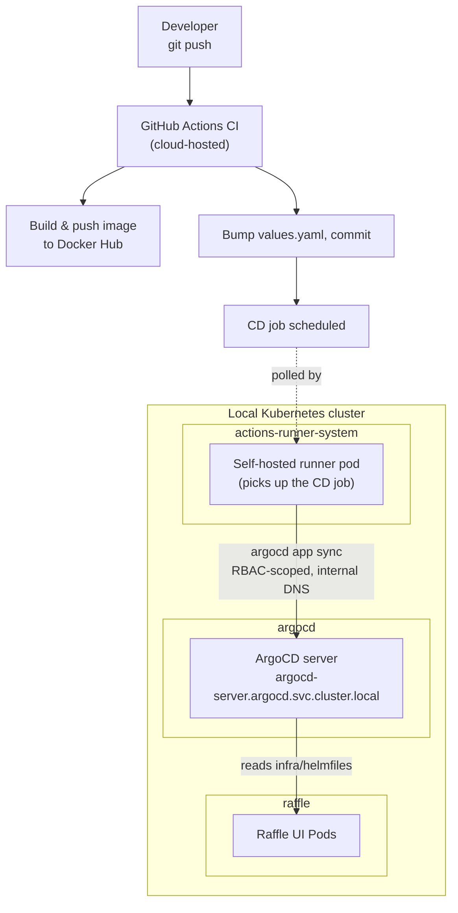

# Raffle — Local Kubernetes GitOps with an In-Cluster CI Runner

A fully local GitOps demo environment: a GitHub Actions **self-hosted runner running as a pod inside the cluster itself** (via Actions Runner Controller) triggers ArgoCD directly over its internal cluster DNS name — no cloud infrastructure, no exposed ArgoCD API, and a runner scoped with least-privilege RBAC rather than cluster-admin.


This is the third deployment strategy for the Raffle dApp, alongside [EKS + ArgoCD (pull-based GitOps)](./README.md) and [EC2 (pull-based, systemd)](./README-EC2.md) — this one runs entirely on a local Kubernetes cluster (kind, minikube, k3d, or Docker Desktop), useful for development, testing the pipeline without cloud cost, or live demos.

## Architecture


```mermaid
flowchart TD
    Dev["Developer\ngit push"] --> CI["GitHub Actions CI\n(cloud-hosted)"]
    CI --> Build["Build & push image\nto Docker Hub"]
    CI --> Bump["Bump values.yaml, commit"]
    Bump --> Schedule["CD job scheduled"]

    subgraph Cluster["Local Kubernetes cluster"]
        subgraph RunnerNS["actions-runner-system"]
            Runner["Self-hosted runner pod\n(picks up the CD job)"]
        end
        subgraph ArgoNS["argocd"]
            ArgoServer["ArgoCD server\nargocd-server.argocd.svc.cluster.local"]
        end
        subgraph AppNS["raffle"]
            Pods["Raffle UI Pods"]
        end
    end

    Schedule -.->|"polled by"| Runner
    Runner -->|"argocd app sync\nRBAC-scoped, internal DNS"| ArgoServer
    ArgoServer -->|"reads infra/helmfiles"| Pods
```

### Why this architecture

- **ArgoCD's internal address is cluster-only.** `argocd-server.argocd.svc.cluster.local` only resolves from inside the cluster's network — a cloud-hosted GitHub Actions runner can't reach it. Running the runner as a pod in the same cluster (via Actions Runner Controller) solves this without exposing ArgoCD's API to the internet.
- **Least-privilege RBAC.** Rather than granting the runner's ServiceAccount cluster-admin, `infra/argocd/argocd-role.yaml` scopes it to `get/list/watch/create/update/patch/delete` on `applications` inside the `argocd` namespace only.
- **Push-triggered, not pull-based.** Unlike the EKS track, CI explicitly calls `argocd app sync` after pushing a new image — useful here for immediate feedback in a local/demo setting rather than waiting on ArgoCD's default polling interval.

## Tech stack

| Layer | Technology |
|---|---|
| Frontend | Next.js, wagmi, viem, RainbowKit |
| Local cluster | kind / minikube / k3d / Docker Desktop |
| GitOps / CD | ArgoCD (push-triggered sync) |
| CI runner | Actions Runner Controller, running in-cluster |
| CI | GitHub Actions |
| Registry | Docker Hub |

## Project structure

```
Lottery/
├── raffle-ui/
├── infra/
│   ├── argocd/
│   │   ├── argocd.yaml         # ArgoCD Helm values
│   │   ├── application.yaml    # ArgoCD Application manifest
│   │   └── argocd-role.yaml    # Scoped RBAC for the in-cluster runner
│   └── helmfiles/              # App Helm chart values
└── .github/workflows/
```

## Prerequisites

- A local Kubernetes cluster (kind, minikube, k3d, or Docker Desktop's built-in cluster)
- [Helm](https://helm.sh/docs/intro/install/) ≥ 3.x
- `kubectl`
- A Docker Hub account
- A GitHub Personal Access Token with `repo` scope, used only to register the self-hosted runner

## Required GitHub secrets

| Secret | Description |
|---|---|
| `ARGOCD_USERNAME` | ArgoCD login (`admin`) |
| `ARGOCD_PASSWORD` | ArgoCD admin password |
| `DOCKERHUB_USERNAME` | Docker Hub username |
| `DOCKERHUB_TOKEN` | Docker Hub access token |
| `NEXT_PUBLIC_SEPOLIA_RPC_URL` | Sepolia RPC endpoint, embedded at build time |
| `NEXT_PUBLIC_WALLET_CONNECT_PROJECT_ID` | WalletConnect project ID |

## Setup guide

### 1. Install ArgoCD

```bash
helm repo add argo https://argoproj.github.io/argo-helm
helm repo update

helm upgrade --install argocd argo/argo-cd -n argocd --create-namespace -f infra/argocd/argocd.yaml
```

Access it locally via port-forward — this works the same regardless of which local cluster tool you use, with no ingress or load balancer required:

```bash
kubectl port-forward service/argocd-server -n argocd 8080:443
```

Open `https://localhost:8080` (self-signed certificate — expected, proceed past the browser warning). Log in as `admin`, password:

```bash
kubectl -n argocd get secret argocd-initial-admin-secret \
  -o jsonpath="{.data.password}" | base64 -d; echo
```

### 2. Install Actions Runner Controller

> **Note:** this uses the original `actions.summerwind.dev`-based ARC (`RunnerDeployment`), which is now the **legacy** implementation — it still works, but GitHub's current recommended path is the [`gha-runner-scale-set`](https://github.com/actions/actions-runner-controller/blob/master/docs/gha-runner-scale-set-controller/README.md) Helm chart (`actions.github.com` API group). Worth migrating to for anything beyond a demo/portfolio setup.

```bash
kubectl apply -f https://github.com/cert-manager/cert-manager/releases/latest/download/cert-manager.yaml
```

Generate a GitHub PAT (`Developer settings → Personal access tokens`, `repo` scope), then install the controller — pass the token via an environment variable rather than pasting it directly into the command, to keep it out of shell history and logs:

```bash
export GITHUB_PAT="<your PAT>"

helm repo add actions-runner-controller https://actions-runner-controller.github.io/actions-runner-controller
helm repo update

helm upgrade --install --namespace actions-runner-system --create-namespace \
  --set=authSecret.create=true \
  --set-string authSecret.github_token="$GITHUB_PAT" \
  --wait actions-runner-controller actions-runner-controller/actions-runner-controller
```

Register the runner:

```bash
cat << EOF | kubectl apply -n actions-runner-system -f -
apiVersion: actions.summerwind.dev/v1alpha1
kind: RunnerDeployment
metadata:
  name: self-hosted-runners
spec:
  replicas: 1
  template:
    spec:
      repository: GOLIBJON-developer/Lottery
EOF
```

Verify:

```bash
kubectl get runners -n actions-runner-system
kubectl get pods -n actions-runner-system
```

### 3. Scope the runner's RBAC

Grants the runner's ServiceAccount just enough permission to manage `Application` resources in the `argocd` namespace — nothing more:

```bash
kubectl apply -f infra/argocd/argocd-role.yaml
```

### 4. Install the ArgoCD CLI (for local troubleshooting)

```bash
curl -sSL -o argocd-linux-amd64 https://github.com/argoproj/argo-cd/releases/latest/download/argocd-linux-amd64
sudo install -m 555 argocd-linux-amd64 /usr/local/bin/argocd
rm argocd-linux-amd64
```

### 5. Configure GitHub repository secrets

**Settings → Secrets and variables → Actions**, add the six secrets listed above.

### 6. Deploy the application

```bash
kubectl apply -f infra/argocd/application.yaml
```

### 7. Ship changes

1. Push a change under `raffle-ui/**` on the `local-k8s` branch.
2. The `ci` job builds the image, pushes it to Docker Hub, bumps `infra/helmfiles/values.yaml`, and commits.
3. The `cd` job is picked up by the in-cluster runner, which logs into ArgoCD over its internal DNS name and runs `argocd app sync raffle --async` followed by `argocd app wait raffle --health`.

> **Alternative:** the same sync step can be written using the maintained [`argoproj/argocd-action@v2`](https://github.com/argoproj/argocd-action) action instead of the manual CLI install + login shown above — functionally equivalent, less pipeline code to maintain.

## Verifying the deployment

```bash
kubectl get pods -n raffle
kubectl get applications -n argocd
```

## Tearing down

Helm-level cleanup, works regardless of which local cluster tool you're using:

```bash
helm uninstall argocd -n argocd
helm uninstall actions-runner-controller -n actions-runner-system
kubectl delete namespace raffle argocd actions-runner-system
```

Or remove the entire local cluster in one step — use whichever matches your setup:

```bash
kind delete cluster
# or
minikube delete
# or
k3d cluster delete
```

## Troubleshooting

**Runner never picks up the `cd` job:** check `kubectl get runners -n actions-runner-system` and `kubectl get pods -n actions-runner-system` — a runner stuck outside `Running` usually means the PAT lacks `repo` scope or has expired.

**`argocd login` fails in the CD job:** confirm `ARGOCD_USERNAME`/`ARGOCD_PASSWORD` match the current admin credentials — the password rotates if the ArgoCD admin secret is ever reset.

---

Built by [Golibjon Sultonmurodov](https://github.com/GOLIBJON-developer) as part of a DevOps/Platform Engineering portfolio.