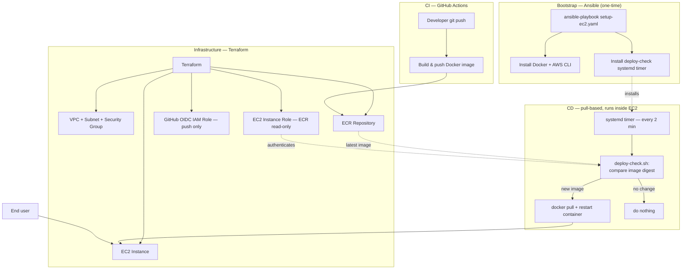

# Raffle — Pull-Based GitOps Deployment on AWS EC2

A secure, pull-based CI/CD pipeline for deploying the Raffle dApp frontend to a single AWS EC2 instance — built with Terraform, Ansible, and a lightweight systemd-based "mini GitOps controller," avoiding traditional SSH-push deployments and unmaintained tools like Watchtower.


This is an alternative deployment strategy for the same Raffle dApp covered by the [EKS + ArgoCD track](./README.md) — a simpler, single-instance setup better suited for smaller workloads or lower infrastructure cost.

## Architecture


```mermaid
flowchart TD
    subgraph Infra["Infrastructure — Terraform"]
        TF[Terraform] --> VPC["VPC + Subnet + Security Group"]
        TF --> EC2i["EC2 Instance"]
        TF --> ECRr["ECR Repository"]
        TF --> IAMg["GitHub OIDC IAM Role — push only"]
        TF --> IAMe["EC2 Instance Role — ECR read-only"]
    end

    subgraph Bootstrap["Bootstrap — Ansible (one-time)"]
        ANS["ansible-playbook setup-ec2.yaml"] --> Docker["Install Docker + AWS CLI"]
        ANS --> Timer["Install deploy-check systemd timer"]
    end

    subgraph CI["CI — GitHub Actions"]
        Dev["Developer git push"] --> Build["Build & push Docker image"]
        Build --> ECRr
    end

    subgraph Pull["CD — pull-based, runs inside EC2"]
        Cron["systemd timer — every 2 min"] --> Check["deploy-check.sh:\ncompare image digest"]
        Check -->|"new image"| Deploy["docker pull + restart container"]
        Check -->|"no change"| Skip["do nothing"]
    end

    ECRr -.->|"latest image"| Check
    Timer -.->|"installs"| Cron
    IAMe -.->|"authenticates"| Check
    Deploy --> EC2i
    User["End user"] --> EC2i
```

GitHub Actions never connects to the server — it only builds the image and pushes it to ECR. The EC2 instance independently polls ECR and pulls new versions itself, the same reconciliation principle ArgoCD uses for Kubernetes, applied to a single VM.

### Why this architecture

1. **No SSH keys in CI.** GitHub Actions never touches the server; it only has ECR push permissions via OIDC.
2. **Short-lived, role-based ECR auth.** `deploy-check.sh` authenticates through the EC2 instance's IAM role on every run — no static credentials, no token-expiry issues like third-party pollers such as Watchtower are known to have.
3. **True pull model.** The server detects and applies changes on its own schedule; nothing external pushes commands to it.

## Project structure

```
Lottery/
├── raffle-ui/              # Next.js frontend application & Dockerfile
├── infra/
│   ├── terraform/          # VPC, EC2, ECR, IAM roles (OIDC + instance)
│   └── ansible/            # Bootstrap playbook, systemd timer, deploy script
└── README.md
```

`infra/` sits at the repository root, alongside `raffle-ui/` — not nested inside it.

## Prerequisites

- An AWS account with sufficient IAM permissions
- [Terraform](https://developer.hashicorp.com/terraform/install) ≥ 1.x
- [Ansible](https://docs.ansible.com/ansible/latest/installation_guide/index.html) ≥ 2.x, with the `community.docker` collection (`ansible-galaxy collection install community.docker`)
- AWS CLI, configured
- An SSH key pair for the fallback access path described below

## Required GitHub secrets

| Secret | Description |
|---|---|
| `AWS_ROLE_ARN` | IAM role ARN for GitHub OIDC authentication — output of the Terraform apply below |
| `NEXT_PUBLIC_SEPOLIA_RPC_URL` | Sepolia RPC endpoint, embedded at build time |
| `NEXT_PUBLIC_WALLET_CONNECT_PROJECT_ID` | WalletConnect project ID |

## Deployment guide

### 1. Clone the repository

```bash
git clone https://github.com/GOLIBJON-developer/Lottery.git
cd Lottery
```

### 2. Provision infrastructure

```bash
cd infra/terraform
cp terraform.tfvars.example terraform.tfvars   # fill in your own values
terraform init
terraform apply
```

This creates the VPC, EC2 instance, ECR repository, the GitHub OIDC IAM role, and the EC2 instance role. Example output:

```
ec2_public_ip           = "<EC2_PUBLIC_IP>"
ecr_repository_url      = "<AWS_ACCOUNT_ID>.dkr.ecr.us-east-1.amazonaws.com/dev-raffle-repo"
github_actions_role_arn = "arn:aws:iam::<AWS_ACCOUNT_ID>:role/dev-github-actions-role"
```

- Copy `ecr_repository_url` into `ECR_URL` (line 6) of `infra/ansible/deploy-check.sh`.
- Copy `github_actions_role_arn` into the `AWS_ROLE_ARN` GitHub secret.

> The security group restricts SSH (port 22) to a single trusted IP (`my_ip` variable) — it is not open to the internet. Day-to-day server management should still go through **AWS SSM Session Manager**, which needs no inbound port at all; SSH is kept only as a restricted fallback.

### 3. Configure GitHub repository secrets

**Settings → Secrets and variables → Actions**, then add the three secrets listed above. Make sure the workflow's `branches` filter in `.github/workflows/*.yaml` matches the branch you intend to deploy from.

### 4. Bootstrap the server (Ansible, one-time)

Ansible uses AWS dynamic inventory to discover the EC2 instance automatically — no manual IP mapping required:

```bash
cd ../ansible
ansible-playbook -i inventory_aws_ec2.yaml setup-ec2.yaml
```

This installs Docker and the AWS CLI, and registers the `deploy-check.timer` systemd unit that drives continuous deployment.

### 5. Ship changes

From here on, deployment is fully automated:

1. Push a change under `raffle-ui/**`.
2. GitHub Actions builds the image and pushes both a versioned tag and `latest` to ECR — it does not touch the server.
3. Within 2 minutes, the EC2 instance's `deploy-check.timer` detects the new image digest, pulls it, and restarts the container.

## Verifying the deployment

```bash
ssh ec2-user@<EC2_PUBLIC_IP>
docker ps
sudo systemctl status deploy-check.timer
sudo journalctl -u deploy-check.service -n 50
```

## Tearing down

Since this setup has no Kubernetes-managed load balancer, cleanup is a single step:

```bash
cd infra/terraform
terraform destroy --auto-approve
```

## Troubleshooting

**Container never updates:** check the timer's logs (`sudo journalctl -u deploy-check.service`) — a common cause is the instance role missing ECR read permissions, or `ECR_URL`/`REPO` in `deploy-check.sh` not matching the actual repository.

**Ansible can't find the host:** confirm `inventory_aws_ec2.yaml` region matches where the instance was created, and that your AWS CLI credentials have `ec2:DescribeInstances` permission.

---

Built by [Golibjon Sultonmurodov](https://github.com/GOLIBJON-developer) as part of a DevOps/Platform Engineering portfolio.