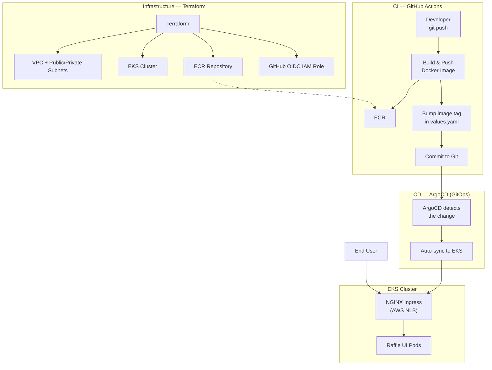

# Raffle — GitOps Deployment on AWS EKS

Infrastructure and CI/CD pipeline for deploying a Web3 raffle dApp to Amazon EKS using Terraform, GitHub Actions, and ArgoCD (GitOps). A `git push` is the only manual step required to ship a new version to production.


## About the app

Raffle is a production-style Web3 lottery dApp built with Next.js on the frontend and a Solidity smart contract using **Chainlink VRF v2.5** for verifiable randomness, covered by a Foundry test suite. This repository covers the **deployment infrastructure** for the frontend — not the contract itself.

## Architecture


```mermaid
flowchart TD
    subgraph Infra["Infrastructure — Terraform"]
        TF[Terraform] --> VPC["VPC + Public/Private Subnets"]
        TF --> EKS["EKS Cluster"]
        TF --> ECR["ECR Repository"]
        TF --> IAM["GitHub OIDC IAM Role"]
    end

    subgraph CI["CI — GitHub Actions"]
        Dev["Developer\ngit push"] --> Build["Build & Push\nDocker Image"]
        Build --> ECRPush["ECR"]
        Build --> Bump["Bump image tag\nin values.yaml"]
        Bump --> Commit["Commit to Git"]
    end

    subgraph CD["CD — ArgoCD (GitOps)"]
        Commit --> Detect["ArgoCD detects\nthe change"]
        Detect --> Sync["Auto-sync to EKS"]
    end

    subgraph Cluster["EKS Cluster"]
        Sync --> Ingress["NGINX Ingress\n(AWS NLB)"]
        Ingress --> Pods["Raffle UI Pods"]
    end

    User["End User"] --> Ingress
    ECR -.-> ECRPush
```

GitHub Actions never connects to the cluster directly — it only builds the image and updates a manifest in Git. ArgoCD is the only component with write access to the cluster, continuously reconciling it against the state described in Git.

## Tech stack

| Layer | Technology |
|---|---|
| Frontend | Next.js, wagmi, viem, RainbowKit |
| Smart contract | Solidity, Chainlink VRF v2.5, Foundry |
| Containerization | Docker |
| Infrastructure as Code | Terraform (VPC, EKS, ECR, IAM/OIDC) |
| Orchestration | Amazon EKS |
| Package management | Helm |
| GitOps / CD | ArgoCD |
| CI | GitHub Actions (OIDC — no long-lived AWS keys) |
| Ingress | NGINX Ingress Controller (AWS NLB) |
| Registry | Amazon ECR |

## Project structure

```
.
├── raffle-ui/                  # Next.js frontend
├── infra/
│   ├── terraform/              # VPC, EKS, ECR, GitHub OIDC IAM role
│   ├── argocd/                 # ArgoCD Helm values + Application manifest
│   └── helmfiles/              # Helm values for the app deployment
└── .github/workflows/          # CI pipeline (build, push, version bump)
```

## Prerequisites

- An AWS account with sufficient IAM permissions
- [Terraform](https://developer.hashicorp.com/terraform/install) ≥ 1.x
- AWS CLI, configured
- `kubectl`
- [Helm](https://helm.sh/docs/intro/install/) ≥ 3.x
- A fork of this repository with GitHub Actions enabled

## Required GitHub secrets

| Secret | Description |
|---|---|
| `AWS_ROLE_ARN_EKS` | IAM role ARN for GitHub OIDC authentication — output of the Terraform apply below |
| `NEXT_PUBLIC_SEPOLIA_RPC_URL` | Sepolia RPC endpoint, embedded at build time |
| `NEXT_PUBLIC_WALLET_CONNECT_PROJECT_ID` | WalletConnect project ID |

## Deployment guide

### 1. Provision infrastructure

```bash
cd infra/terraform
terraform apply --auto-approve
```

This creates the VPC, EKS cluster, ECR repository, and the GitHub OIDC IAM role. Copy the `github_actions_role_arn` output into the `AWS_ROLE_ARN_EKS` GitHub secret.

### 2. Connect to the cluster

```bash
aws eks update-kubeconfig --region us-east-1 --name myapp-eks-cluster
```

### 3. Install the NGINX Ingress Controller

Provisions an AWS Network Load Balancer for cluster ingress:

```bash
helm repo add ingress-nginx https://kubernetes.github.io/ingress-nginx
helm repo update

helm upgrade --install ingress-nginx ingress-nginx/ingress-nginx \
  --namespace ingress-nginx --create-namespace \
  --set controller.service.type=LoadBalancer \
  --set controller.service.annotations."service\.beta\.kubernetes\.io/aws-load-balancer-type"="nlb"
```

### 4. Install ArgoCD

```bash
helm repo add argo https://argoproj.github.io/argo-helm
helm repo update

cd infra/argocd
helm upgrade --install argocd argo/argo-cd -n argocd --create-namespace -f argocd.yaml
```

Retrieve the initial admin password:

```bash
kubectl -n argocd get secret argocd-initial-admin-secret \
  -o jsonpath="{.data.password}" | base64 -d; echo
```

### 5. Point a domain at the ingress

```bash
kubectl get svc -n ingress-nginx ingress-nginx-controller
```

Resolve the returned load balancer hostname to an IP and point your domain(s) at it — `argocd.example.com` for the ArgoCD UI, `raffle.yourdomain.com` for the app. Without a real domain, map the IP locally instead (`/etc/hosts` on macOS/Linux, `C:\Windows\System32\drivers\etc\hosts` on Windows):

```
<LOAD_BALANCER_IP>  argocd.example.com
<LOAD_BALANCER_IP>  raffle.yourdomain.com
```

> ArgoCD's ingress uses a self-signed certificate by default, so browsers will show a security warning on first visit — expected in this setup. For production, issue a real certificate via `cert-manager`.

### 6. Deploy the application

```bash
kubectl apply -f infra/argocd/application.yaml
```

ArgoCD creates the `raffle` namespace and syncs the Helm release defined in `infra/helmfiles`.

### 7. Ship changes

From here on, deployment is fully automated:

1. Push a change under `raffle-ui/**`.
2. GitHub Actions builds the image, pushes it to ECR, bumps the version, and commits the new tag to `infra/helmfiles/values.yaml`.
3. ArgoCD detects the change and syncs it to the cluster — no manual deploy step.

## Verifying the deployment

```bash
kubectl get pods -n raffle
```

## Tearing down

```bash
cd infra/terraform
bash destroy.sh
```

The script uninstalls the ArgoCD and NGINX Ingress Helm releases, waits for AWS to fully release the associated Load Balancer and its network interfaces, and only then runs `terraform destroy` — avoiding the `DependencyViolation` errors that occur when a VPC is destroyed while a Kubernetes-managed Load Balancer still references its subnets.

## Troubleshooting

**Pods stuck `Pending` — node group full:**

```bash
aws eks update-nodegroup-config \
  --cluster-name myapp-eks-cluster \
  --nodegroup-name <your-nodegroup-name> \
  --scaling-config minSize=2,desiredSize=3,maxSize=3
```

**ArgoCD sync fails with `context deadline exceeded`:** usually caused by CPU/memory limits on `repoServer` throttling manifest generation. Increase (or remove) `repoServer.resources.limits` in `argocd.yaml` and re-run `helm upgrade`.

---

Built by [Golibjon Sultonmurodov](https://github.com/GOLIBJON-developer) as part of a DevOps/Platform Engineering portfolio.